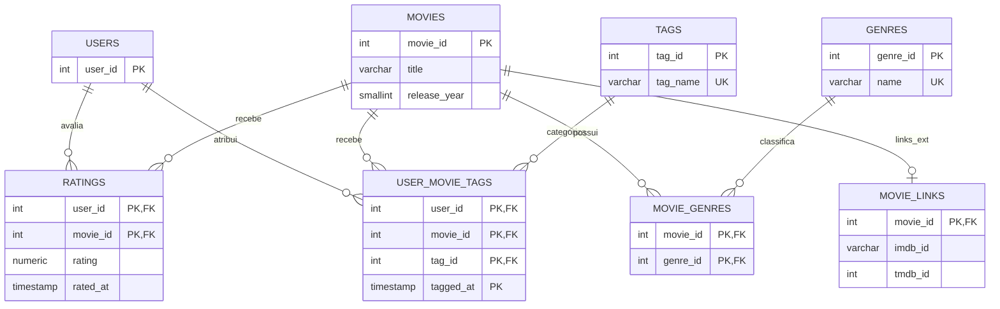
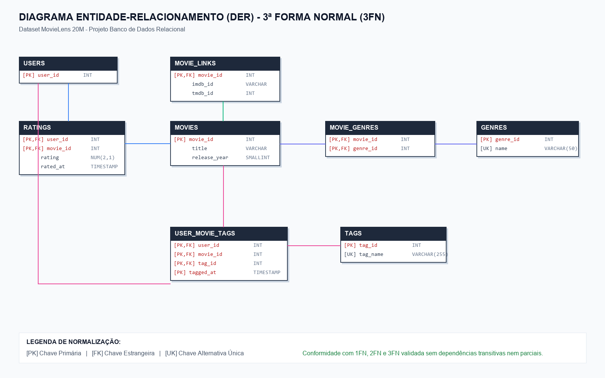

# Análise Comparativa: Banco de Dados Relacional (PostgreSQL / SQLite) vs. Não-Relacional Orientado a Documentos (MongoDB)

**Dataset Analisado:** MovieLens 20M (GroupLens Research)  
**Contexto:** Estudo comparativo de engenharia de dados entre os paradigmas **Relacional (3FN)** e **NoSQL (Document Store)**.

---

## 1. Introdução e Contextualização do Problema

O objetivo deste estudo é analisar, modelar, implementar e confrontar duas abordagens fundamentais de gerenciamento de dados utilizando uma mesma base de dados pública: o conceituado dataset **MovieLens 20M**.

O dataset original é composto por atributos cadastrais de obras cinematográficas (`movie.csv`), links para catálogos externos (`link.csv`), termos de indexação semântica atribuídos por usuários (`tag.csv`) e um volume massivo de mais de **20 milhões de avaliações** numéricas (`rating.csv`).

O desafio arquitetural reside em como representar essas relações em dois paradigmas antagônicos:
1. **Paradigma Relacional**: Focado na **eliminação de redundâncias** através das regras formais de normalização de Edgar F. Codd (1FN, 2FN e 3FN), garantindo integridade estrita via chaves primárias e estrangeiras com propriedades **ACID**.
2. **Paradigma Não-Relacional (Documental)**: Focado em **otimização de leitura e escalabilidade**, utilizando desnormalização consciente, incorporação (*embedding*) de estruturas hierárquicas e agregação pré-computada (*Computed Pattern*).

---

## 2. Modelagem e Estrutura de Dados

### 2.1. Abordagem Relacional (PostgreSQL / SQLite - 3FN)

No modelo relacional, a base bruta foi submetida ao processo rigoroso de normalização:
* **1ª Forma Normal (1FN)**: O atributo multivalorado `genres` (ex: `"Action|Adventure|Sci-Fi"`) foi atomizado em uma tabela catálogo `genres` e uma associativa $N:M$ `movie_genres`. O campo composto `title` foi quebrado em `title` e `release_year`.
* **2ª Forma Normal (2FN)**: Chaves compostas como `(user_id, movie_id)` em `ratings` foram isoladas para que nenhum atributo não-chave dependesse parcialmente da chave primária.
* **3ª Forma Normal (3FN)**: Os textos de tags livres foram segregados em um catálogo unívoco `tags` (`tag_id`, `tag_name`), eliminando a repetição textual de strings em centenas de milhares de linhas e evitando anomalias de atualização. Os identificadores externos do IMDb e TMDb foram isolados na relação $1:1$ `movie_links`.



> **Diagrama Gráfico Exportado:**  
> 


* **Resultado Relacional**: Os dados ficaram distribuídos em **8 tabelas distintas**.

---

### 2.2. Abordagem Não-Relacional (MongoDB)

No MongoDB, abandonamos a pulverização de tabelas e projetamos a base considerando o princípio basilar do NoSQL: **"Dados consultados em conjunto devem ser armazenados em conjunto"**.

A arquitetura documental foi estruturada em apenas **2 coleções**:

1. **Coleção `movies` (Documento Rico com Embedding)**:
   * **Gêneros Incorporados**: Array de strings (`["Adventure", "Animation", "Children"]`). Cardinalidade baixa e estática (1 a 6 elementos). Evita junções e viabiliza índices *Multikey*.
   * **Links Incorporados**: Subdocumento `{ imdb: "0114709", tmdb: 862 }`. Relação $1:1$ fixa.
   * **Tags Únicas Incorporadas**: Array com o vocabulário de termos associados ao filme, permitindo busca textual indexada direta.
   * **Métricas Pré-computadas**: Subdocumento `{ avg_rating: 3.97, rating_count: 241 }` utilizando o padrão de projeto *Computed Pattern*. Elimina o custo de varrer 20 milhões de avaliações a cada requisição de catálogo.

2. **Coleção `ratings` (Coleção Referenciada)**:
   * **Decisão Arquitetural Crítica**: As 20 milhões de avaliações **não** foram incorporadas no filme.
   * **Motivo**: Incorporar 50.000 avaliações no documento de *Toy Story* violaria ou consumiria perigosamente o **limite de 16 MB por documento BSON** do MongoDB, causaria fragmentação contínua de blocos em disco (*Document Growth Penalty*) e sobrecarregaria a memória com dados desnecessários na renderização da ficha técnica da obra.

```json
// Documento Representativo na Coleção 'movies' (MongoDB)
{
  "_id": 1,
  "title": "Toy Story",
  "release_year": 1995,
  "genres": ["Adventure", "Animation", "Children", "Comedy", "Fantasy"],
  "links": {
    "imdb": "0114709",
    "tmdb": 862
  },
  "metrics": {
    "avg_rating": 3.97,
    "rating_count": 241
  },
  "tags": ["animation", "pixar", "toys", "disney"]
}
```

---

## 3. Confronto Direto de Consultas (SQL vs. MQL)

A seguir, confrontamos 4 consultas essenciais de negócio nas duas abordagens:

### Consulta 1: Detalhes Completos de um Filme

* **Objetivo**: Recuperar título, ano, identificadores externos, lista de gêneros e média de avaliações do filme ID 1 (*Toy Story*).

#### No Modelo Relacional (SQL):
```sql
SELECT 
    m.movie_id,
    m.title,
    m.release_year,
    l.imdb_id,
    l.tmdb_id,
    GROUP_CONCAT(DISTINCT g.name) AS genres,
    COUNT(r.rating) AS total_ratings,
    ROUND(AVG(r.rating), 2) AS avg_rating
FROM movies m
LEFT JOIN movie_links l ON m.movie_id = l.movie_id
LEFT JOIN movie_genres mg ON m.movie_id = mg.movie_id
LEFT JOIN genres g ON mg.genre_id = g.genre_id
LEFT JOIN ratings r ON m.movie_id = r.movie_id
WHERE m.movie_id = 1
GROUP BY m.movie_id, m.title, m.release_year, l.imdb_id, l.tmdb_id;
```
* **Complexidade no Relacional**: O banco precisa ler a tabela de filmes, efetuar 4 operações de junção (`Nested Loop` ou `Hash Join`), escanear a tabela de junção $N:M$, agrupar os resultados na memória e computar agregações em tempo de execução.

#### No Modelo Documental (MongoDB):
```javascript
db.movies.findOne(
    { _id: 1 },
    { title: 1, release_year: 1, genres: 1, links: 1, metrics: 1 }
);
```
* **Complexidade no MongoDB**: Busca direta pela chave primária `_id` em tempo **$O(1)$** no índice B-Tree principal. Todos os dados já estão contíguos no mesmo documento BSON. Zero operações de junção.

---

### Consulta 2: Top 10 Filmes Mais Bem Avaliados (Mínimo de 50 Votos)

#### No Modelo Relacional (SQL):
```sql
SELECT 
    m.movie_id,
    m.title,
    m.release_year,
    COUNT(r.rating) AS vote_count,
    ROUND(AVG(r.rating), 3) AS average_rating
FROM movies m
JOIN ratings r ON m.movie_id = r.movie_id
GROUP BY m.movie_id, m.title, m.release_year
HAVING COUNT(r.rating) >= 50
ORDER BY average_rating DESC, vote_count DESC
LIMIT 10;
```

#### No Modelo Documental (MongoDB):
* **Opção A (Via dados pré-computados - Padrão Computed)**:
```javascript
db.movies.find(
    { "metrics.rating_count": { $gte: 50 } },
    { title: 1, release_year: 1, "metrics.avg_rating": 1, "metrics.rating_count": 1 }
).sort({ "metrics.avg_rating": -1, "metrics.rating_count": -1 }).limit(10);
```
* **Opção B (Via Aggregation Pipeline dinâmico na coleção `ratings`)**:
```javascript
db.ratings.aggregate([
    { $group: { _id: "$movie_id", avg_rating: { $avg: "$rating" }, vote_count: { $sum: 1 } } },
    { $match: { vote_count: { $gte: 50 } } },
    { $sort: { avg_rating: -1, vote_count: -1 } },
    { $limit: 10 },
    { $lookup: { from: "movies", localField: "_id", foreignField: "_id", as: "movie" } },
    { $unwind: "$movie" },
    { $project: { title: "$movie.title", release_year: "$movie.release_year", avg_rating: { $round: ["$avg_rating", 3] }, vote_count: 1 } }
]);
```

---

### Consulta 3: Agrupamento e Distribuição por Gênero

#### No Modelo Relacional (SQL):
```sql
SELECT 
    g.name AS genre,
    COUNT(DISTINCT m.movie_id) AS total_movies,
    ROUND(AVG(r.rating), 2) AS avg_genre_rating
FROM genres g
JOIN movie_genres mg ON g.genre_id = mg.genre_id
JOIN movies m ON mg.movie_id = m.movie_id
LEFT JOIN ratings r ON m.movie_id = r.movie_id
GROUP BY g.genre_id, g.name
ORDER BY total_movies DESC;
```

#### No Modelo Documental (MongoDB):
```javascript
db.movies.aggregate([
    { $unwind: "$genres" },
    {
        $group: {
            _id: "$genres",
            total_movies: { $sum: 1 },
            avg_genre_rating: { $avg: "$metrics.avg_rating" }
        }
    },
    { $project: { genre: "$_id", _id: 0, total_movies: 1, avg_genre_rating: { $round: ["$avg_genre_rating", 2] } } },
    { $sort: { total_movies: -1 } }
]);
```
* **Análise Técnica**: O operador `$unwind` no MongoDB descompacta o array de gêneros em tuplas temporárias no fluxo de agregação, operando de forma análoga a uma junção relacional em memória.

---

### Consulta 4: Busca por Termos de Etiquetagem (Tags)

* **Objetivo**: Localizar filmes etiquetados como `'pixar'` ou `'animation'`.

#### No Modelo Relacional (SQL):
```sql
SELECT DISTINCT
    m.movie_id,
    m.title,
    m.release_year,
    t.tag_name
FROM movies m
JOIN user_movie_tags umt ON m.movie_id = umt.movie_id
JOIN tags t ON umt.tag_id = t.tag_id
WHERE t.tag_name IN ('pixar', 'animation')
LIMIT 20;
```
* Exige junção tripla entre `movies`, a tabela intermediária `user_movie_tags` e a tabela `tags`.

#### No Modelo Documental (MongoDB):
```javascript
db.movies.find(
    { tags: { $in: ["pixar", "animation"] } },
    { title: 1, release_year: 1, tags: 1, genres: 1 }
).limit(20);
```
* O MongoDB utiliza seu **índice *Multikey*** diretamente sobre o array `tags`, encontrando as correspondências sem nenhuma junção.

---

## 4. Análise Comparativa Detalhada

### 4.1. Esquema, Flexibilidade e Integridade

| Critério | Relacional (PostgreSQL / SQLite) | NoSQL Documental (MongoDB) |
| :--- | :--- | :--- |
| **Definição de Esquema** | **Schema-on-Write**: Esquema rígido, validado antes da gravação no disco. | **Schema-on-Read / Dynamic**: O banco aceita estruturas heterogêneas sem migrações de DDL. |
| **Evolução de Atributos** | Exige `ALTER TABLE`, bloqueios de tabela ou preenchimento de colunas nulas. | Novos campos podem ser adicionados a documentos futuros sem alterar os existentes. |
| **Integridade Referencial** | Garantida nativamente pelo motor (`FOREIGN KEY`, `ON DELETE CASCADE`, `CHECK`). | Gerenciada pela camada de aplicação. Risco de documentos com referências órfãs. |
| **Normalização** | Máxima (3FN). Zero redundância física nas tabelas canônicas. | Controlada. Desnormalização para leitura acelerada. |

---

### 4.2. Transações e Propriedades ACID vs. Teorema CAP

* **PostgreSQL (ACID Estrito)**:
  * **Atomicidade, Consistência, Isolamento e Durabilidade**: Assegura que uma operação complexa (ex: registrar um usuário, associar uma tag e computar uma nota) ou seja gravada em sua totalidade ou seja revertida (`ROLLBACK`).
  * Ideal para ambientes transacionais bancários, contábeis e de estoque.
* **MongoDB (Teorema CAP & BASE)**:
  * **Classificação no CAP**: Sistema tipicamente **CP** (Consistência e Tolerância a Particionamento na réplica primária) ou ajustável para **AP** na leitura secundária com consistência eventual.
  * **Atomicidade em Nível de Documento**: Toda alteração em um único documento (incluindo seus arrays e subdocumentos embutidos) é atômica nativamente.
  * Possui transações multi-documento desde a versão 4.0, porém com custo de coordenação e travamento que contradiz o propósito original de máxima vazão horizontal do NoSQL.

---

### 4.3. Desempenho e Armazenamento

1. **Volume em Disco e Compressão**:
   * O modelo relacional armazena tipos binários compactos (ex: `SMALLINT` ocupa 2 bytes; IDs inteiros ocupam 4 bytes).
   * O formato BSON do MongoDB armazena o nome das chaves em cada documento (`"title"`, `"release_year"`, `"genres"`). Embora o motor WiredTiger aplique compressão Snappy/zlib eficiente, documentos BSON crus possuem uma pegada de memória superior à de tuplas relacionais puras.
2. **Latência de Leitura**:
   * **Vantagem Expressiva do MongoDB** nas telas de catálogo e detalhes: Uma única requisição HTTP para a API recupera o documento do filme pronto com gêneros, notas médias e links em uma única busca indexada.
   * No relacional, a mesma tela exige a construção de um plano de junção com múltiplos escaneamentos de índices e agregação em tempo de execução.
3. **Escrita em Massa**:
   * O PostgreSQL com o comando `COPY` é extraordinariamente eficiente para inserções em massa tabulares.
   * O MongoDB com `insert_many` em *shards* distribuídos permite particionamento horizontal (*sharding*) transparente para volumes que superam o limite de uma única máquina física.

---

## 5. Matriz Síntese de Decisão

```text
+-------------------------+---------------------------------+---------------------------------+
| Dimensão                | SGBD Relacional (PostgreSQL)    | SGBD Documental (MongoDB)       |
+-------------------------+---------------------------------+---------------------------------+
| Paradigma Principal     | Tabelas, Tuplas e Relações      | Coleções e Documentos BSON/JSON |
| Normalização            | Estrita até 3FN                 | Desnormalização estratégica     |
| Operação de Junção      | Nativas, robustas e universais  | Evitadas ($lookup restrito)     |
| Consultas Complexas     | SQL declarativo poderoso        | MQL e Aggregation Pipelines     |
| Padrão de Escalabilidade| Vertical (Scale-Up)             | Horizontal nativo (Scale-Out)   |
| Integridade de Dados    | No motor de banco de dados      | Delegada à camada de software   |
| Caso de Uso no MovieLens| Relatórios corporativos e BI    | API REST de Catálogo e Streaming|
+-------------------------+---------------------------------+---------------------------------+
```

---

## 6. Conclusão e Recomendações Práticas

1. **Quando adotar a Abordagem Relacional (PostgreSQL)**:
   * Quando o modelo de negócios exigir relacionamentos de muitos-para-muitos complexos e imprevisíveis.
   * Quando a consistência imediata e a ausência absoluta de dados órfãos forem mandatórias.
   * Para análises ad-hoc de *Business Intelligence* (BI), onde analistas precisam cruzar tabelas de maneiras não antecipadas durante o design inicial.

2. **Quando adotar a Abordagem NoSQL Documental (MongoDB)**:
   * Em plataformas de streaming, e-commerces e catálogos interativos, onde a leitura rápida de objetos completos (*Aggregate Roots*) dita a experiência do usuário.
   * Em arquiteturas de microsserviços onde cada serviço possui seu próprio modelo encapsulado e flexível.
   * Quando o volume de dados ultrapassa a capacidade de armazenamento de um único nó e exige escalabilidade horizontal via *sharding*.

3. **Arquitetura Moderna Recomendada (Persistência Poliglota)**:
   * Em uma aplicação real de grande porte inspirada no MovieLens/Netflix, a melhor engenharia não escolhe um em detrimento do outro, mas adota **Persistência Poliglota**:
     * **PostgreSQL**: Gerencia cadastros de usuários, transações de assinaturas e catálogo mestre com integridade estrita.
     * **MongoDB / Document Store**: Serve a API pública com o catálogo desnormalizado e enriquecido para renderização ultra-rápida.
     * **Redis**: Armazena em cache as sessões e os Top Filmes mais acessados.
